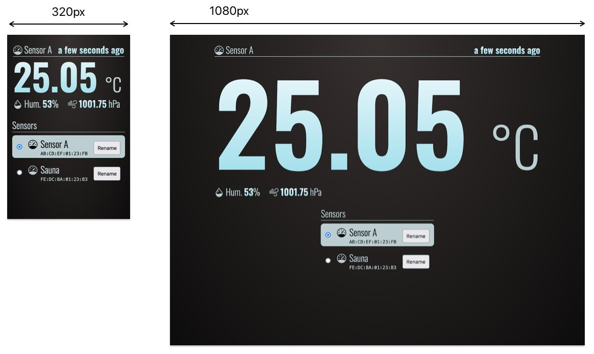

# Simple sensor data station

A Python implementation of a system that simply collects and shows measurement BLE broadcasts it has received from any nearby [RuuviTag](https://ruuvi.com) sensors, and possibly others in future versions. The web interface is served on a local address.

The data is stored into a local SQLite database `./readings.db`. The frontend is written in plain CSS/JS with everything statically included, which means there is no need to compile or install dependencies.

The script runs concurrently the following subcomponents:
* [RuuviTag scanner](https://ttu.github.io/ruuvitag-sensor/) scanning sensor data using Bluetooth
* [AIOHTTP](https://docs.aiohttp.org/) web server serving a page to view the sensor data

This version has been tested on **macOS** (Macbook Air M1) and **Raspberry Pi OS** (Raspberry Pi Zero W 2).

### Web interface

The responsive interface should adapt to majority of devices and screen configurations.

### Features

* Automatically pick up detected tags and show the measurements
* Automatically recover if server is temporarily unreachable
* Data is refreshed in 5 second intervals
* Time is shown relative to current time ("X ago" format)
* Window/tab title also shows the temperature
* Sensor stays selected over reloads (only selected MAC stored in `sessionStorage`)
* Sensors can be named (max 255 characters)

### Installation

Initialize `venv` ([Python virtual environment](https://docs.python.org/3/library/venv.html)) in the directory:

	# On some systems the command starts "python3"
	python -m venv .venv

Activate virtual environment and install dependencies from [requirements.txt](requirements.txt):

	source .venv/bin/activate
	pip install -r requirements.txt

Run the system:

	./main.py

The script creates the database file (unless it exists), and starts listening to BLE broadcasts until it is shut down.

Once running, the web interface can be seen at http://localhost:8080, or with local IP http://\<local-ip>:8080.

### Self-hosted frontend resources

Some frontend resources have been statically included to simplify installation and dependency management.

* Fontsource Fonts:\
https://fontsource.org/fonts/oswald
* Bootstrap Icons:\
https://icons.getbootstrap.com
* Day.js – relative time format ("X ago"):\
https://day.js.org/en/

### Future developments

* Add chart graphics to visualize trends (sparkline)
* Add an API for receiving sensor data over the web
* Add support for other sensors as well (for example, Raspberry Pi Pico)
* Add threshold levels that trigger given actions (for example, min/max level that changes text to red)
* Localizations, Fahrenheit

### Licence

MIT
